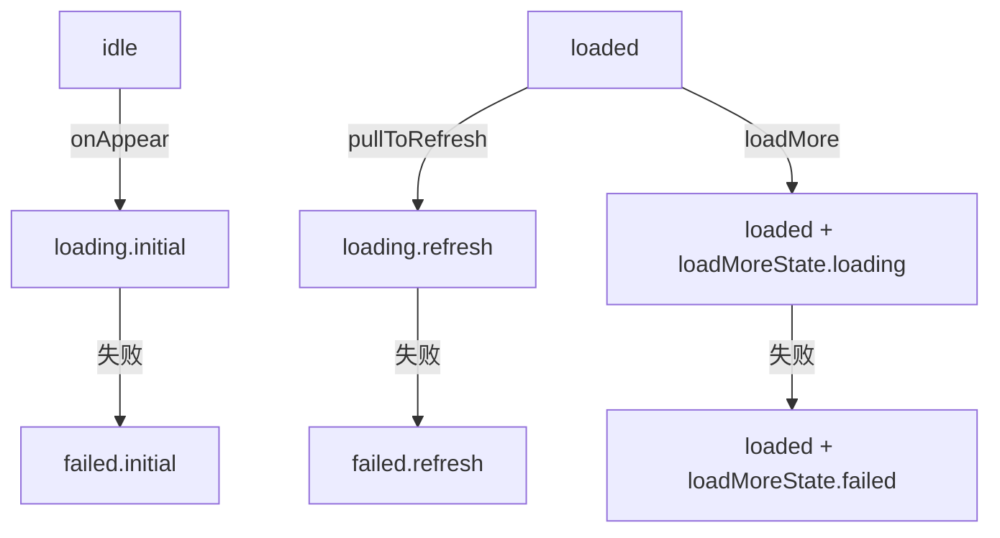
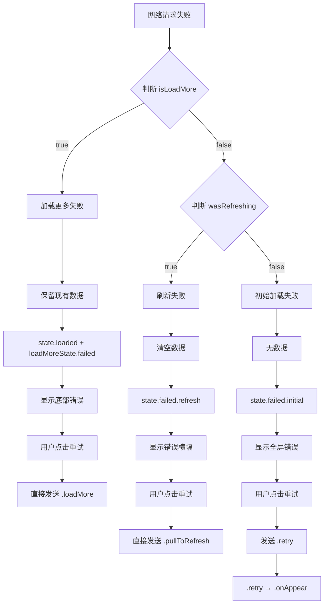

# 网络错误判断与重试逻辑详解
## Error Detection and Retry Logic Analysis

---

## 核心问题 / Core Questions

1. **如何判断网络错误的类型？**（是下拉刷新错误、上拉加载错误还是首次请求错误）
2. **如何判断重试请求的类型？**（是重试下拉刷新、重试加载更多还是重试首次请求）

---

## 一、错误类型判断机制 / Error Type Detection Mechanism

### 1.1 核心判断逻辑位置

**文件：** `RefreshableListFeature.swift`  
**位置：** `dataResponse` Action 处理部分（行 210-267）

### 1.2 判断流程详解

```swift
case let .dataResponse(result, isLoadMore, previousData):
    switch result {
    case .failure(error):
        // 错误处理的核心判断逻辑
        if isLoadMore {
            // 情况1：加载更多失败
            // 通过 isLoadMore 参数判断
        } else {
            // 情况2：需要进一步判断是初始加载还是刷新
            let wasRefreshing = if case .loading(.refresh) = state.pageState { 
                true 
            } else { 
                false 
            }
            
            if wasRefreshing {
                // 情况2.1：刷新失败
            } else {
                // 情况2.2：初始加载失败
            }
        }
    }
```

### 1.3 三种错误类型的判断依据

#### 🔴 **首次加载错误判断**

```swift
判断条件：
1. isLoadMore = false（不是加载更多）
2. state.pageState 之前的状态不是 .loading(.refresh)
3. 通常之前的状态是 .loading(.initial)

判断代码：
if !isLoadMore && !wasRefreshing {
    // 这是首次加载错误
    state.pageState = .failed(.initial, errorInfo)
}
```

#### 🔵 **下拉刷新错误判断**

```swift
判断条件：
1. isLoadMore = false（不是加载更多）
2. state.pageState 之前的状态是 .loading(.refresh)

判断代码：
let wasRefreshing = if case .loading(.refresh) = state.pageState { true } else { false }

if !isLoadMore && wasRefreshing {
    // 这是刷新错误
    state.pageState = .failed(.refresh, errorInfo)
    state.refreshErrorInfo = errorInfo  // 额外记录刷新错误信息
}
```

#### 🟢 **上拉加载更多错误判断**

```swift
判断条件：
1. isLoadMore = true（明确标记为加载更多）
2. 当前状态是 .loaded(data, .loading)

判断代码：
if isLoadMore {
    // 这是加载更多错误
    if case let .loaded(data, _) = state.pageState {
        state.pageState = .loaded(data, .failed(errorInfo))
        // 注意：保留现有数据，只更新加载状态
    }
}
```

---

## 二、错误类型判断的关键参数 / Key Parameters for Error Type Detection

### 2.1 isLoadMore 参数

**来源追踪：**

```swift
// 1. 下拉刷新时设置为 false
case .pullToRefresh:
    return .run { send in
        // ...
        await send(.dataResponse(.success(data), isLoadMore: false, previousData: previousData))
        //                                        ^^^^^^^^^^^^^^^^
    }

// 2. 首次加载时设置为 false
case .onAppear:
    return .run { send in
        // ...
        await send(.dataResponse(.success(data), isLoadMore: false, previousData: nil))
        //                                        ^^^^^^^^^^^^^^^^
    }

// 3. 加载更多时设置为 true
case .loadMore:
    return .run { send in
        // ...
        await send(.dataResponse(.success(newData), isLoadMore: true, previousData: nil))
        //                                           ^^^^^^^^^^^^^^^
    }
```

### 2.2 state.pageState 状态

**状态流转图：**



### 2.3 判断逻辑完整代码

```swift
// RefreshableListFeature.swift 行 240-266
case let .failure(error):
    // 创建错误信息
    let errorInfo = ReduxPageState<ListData<MockItem>>.ErrorInfo(
        type: .networkConnection,
        description: error.localizedDescription
    )
    
    if isLoadMore {
        // ✅ 加载更多失败的判断
        // 保留现有数据，显示加载更多错误
        if case let .loaded(data, _) = state.pageState {
            state.pageState = .loaded(data, .failed(errorInfo))
        }
    } else {
        // 需要进一步判断是刷新还是初始加载
        // 🔍 关键判断：检查之前是否在刷新
        let wasRefreshing = if case .loading(.refresh) = state.pageState { 
            true 
        } else { 
            false 
        }
        
        if wasRefreshing {
            // ✅ 刷新失败的判断
            // 刷新失败时清空数据，显示错误视图
            state.pageState = .failed(.refresh, errorInfo)
            state.refreshErrorInfo = errorInfo
        } else {
            // ✅ 初始加载失败的判断
            state.pageState = .failed(.initial, errorInfo)
        }
    }
```

---

## 三、重试请求类型判断机制 / Retry Request Type Detection

### 3.1 重试 Action 的处理逻辑

**文件：** `RefreshableListFeature.swift`  
**位置：** `retry` Action 处理（行 278-291）

```swift
case .retry:
    // 重试初始加载失败的情况
    if case .failed(.initial, _) = state.pageState {
        // ✅ 判断：这是初始加载失败的重试
        state.pageState = .idle
        state.showLoadingOverlay = true
        return .send(.onAppear)  // 触发初始加载
        
    } else if case .failed(.refresh, _) = state.pageState {
        // ✅ 判断：这是刷新失败的重试
        state.pageState = .idle
        state.showLoadingOverlay = true
        return .send(.onAppear)  // 也是触发初始加载
    }
    return .none
```

### 3.2 三种场景的重试机制

#### 🔴 **首次加载失败的重试**

```swift
触发位置：InitialErrorView 中的重试按钮
判断依据：state.pageState == .failed(.initial, _)

// RefreshableListView.swift 行 689
Button(action: { viewStore.send(.retry) }) {
    Label("重试 / Retry", systemImage: "arrow.clockwise")
}

重试流程：
1. 用户点击重试按钮
2. 发送 .retry Action
3. Reducer 判断 state.pageState 是 .failed(.initial, _)
4. 重置状态为 .idle
5. 发送 .onAppear Action 重新加载
```

#### 🔵 **下拉刷新失败的重试**

```swift
触发位置：RefreshErrorBanner 中的重试按钮
判断依据：不是通过 .retry，而是直接发送 .pullToRefresh

// RefreshableListView.swift 行 548 和 行 607
Button(action: { viewStore.send(.pullToRefresh) }) {
    Text("重试 / Retry")
}

重试流程：
1. 用户点击错误横幅中的重试按钮
2. 直接发送 .pullToRefresh Action
3. 不经过 .retry Action，直接执行刷新逻辑
```

#### 🟢 **加载更多失败的重试**

```swift
触发位置：LoadMoreView 中的重试按钮
判断依据：不是通过 .retry，而是直接调用 onLoadMore

// RefreshableListView.swift 行 894
Button(action: onLoadMore) {
    HStack {
        Image(systemName: "arrow.clockwise")
        Text("点击重试 / Tap to retry")
    }
}

// onLoadMore 的定义（行 809）
let onLoadMore: () -> Void  // 这个闭包会发送 .loadMore Action

重试流程：
1. 用户点击底部错误区域的重试按钮
2. 调用 onLoadMore 闭包
3. 发送 .loadMore Action
4. 重新尝试加载下一页
```

---

## 四、重试请求类型判断总结 / Retry Request Type Summary

### 4.1 判断表格

| 错误类型 | 重试触发方式 | 判断依据 | 最终执行的 Action |
|---------|------------|---------|-----------------|
| **初始加载失败** | 发送 `.retry` | `state.pageState == .failed(.initial, _)` | `.onAppear` |
| **刷新失败** | 发送 `.pullToRefresh` | 直接调用，不判断 | `.pullToRefresh` |
| **加载更多失败** | 调用 `onLoadMore` | 直接调用，不判断 | `.loadMore` |

### 4.2 为什么重试机制不同？

```swift
原因分析：

1. 初始加载失败：
   - 需要完全重新开始，所以通过 .retry → .onAppear
   - 状态需要重置为 .idle

2. 刷新失败：
   - 用户期望的是"刷新"操作，所以直接 .pullToRefresh
   - 保持刷新的语义，而不是重新加载

3. 加载更多失败：
   - 用户期望的是"继续加载"，所以直接 .loadMore
   - 保持当前页码和数据，只是重试下一页
```

---

## 五、完整的错误处理流程图 / Complete Error Handling Flow



---

## 六、代码示例：如何在调试中验证 / Code Example: Debug Verification

### 6.1 添加调试日志

```swift
// 在 RefreshableListFeature.swift 中添加日志

case let .dataResponse(result, isLoadMore, previousData):
    // 添加调试日志
    print("📊 ========== dataResponse Debug ==========")
    print("📊 isLoadMore: \(isLoadMore)")
    print("📊 Current pageState: \(state.pageState)")
    print("📊 Result: \(result)")
    
    switch result {
    case .failure(let error):
        let wasRefreshing = if case .loading(.refresh) = state.pageState { 
            true 
        } else { 
            false 
        }
        
        print("🔴 Error occurred!")
        print("🔴 wasRefreshing: \(wasRefreshing)")
        print("🔴 Error: \(error)")
        
        if isLoadMore {
            print("✅ Detected: Load More Error")
        } else if wasRefreshing {
            print("✅ Detected: Refresh Error")
        } else {
            print("✅ Detected: Initial Load Error")
        }
        
    case .success:
        print("✅ Success")
    }
```

### 6.2 追踪重试类型

```swift
case .retry:
    print("🔄 ========== Retry Debug ==========")
    print("🔄 Current state: \(state.pageState)")
    
    if case .failed(.initial, _) = state.pageState {
        print("🔄 Retrying: Initial Load")
    } else if case .failed(.refresh, _) = state.pageState {
        print("🔄 Retrying: Refresh (via onAppear)")
    }

case .pullToRefresh:
    print("🔄 Direct Refresh Retry")
    
case .loadMore:
    print("🔄 Direct Load More Retry")
```

---

## 七、关键洞察 / Key Insights

### 7.1 错误类型判断的关键

1. **isLoadMore 参数是第一层判断**
   - `true` → 一定是加载更多错误
   - `false` → 需要进一步判断

2. **pageState 的当前状态是第二层判断**
   - `.loading(.refresh)` → 刷新错误
   - 其他 → 初始加载错误

### 7.2 重试机制的设计哲学

1. **语义保持**
   - 刷新失败 → 重试还是刷新
   - 加载更多失败 → 重试还是加载更多
   - 只有初始加载失败使用通用的 .retry

2. **状态管理**
   - 初始加载失败需要完全重置（.idle → .onAppear）
   - 刷新和加载更多保持原有流程

### 7.3 错误信息的保存策略

```swift
// 不同错误的信息保存方式
1. 初始加载错误：直接在 pageState 中
   state.pageState = .failed(.initial, errorInfo)

2. 刷新错误：双重保存
   state.pageState = .failed(.refresh, errorInfo)
   state.refreshErrorInfo = errorInfo  // 额外保存用于横幅显示

3. 加载更多错误：嵌套在 loaded 状态中
   state.pageState = .loaded(data, .failed(errorInfo))
```

---

## 八、实际应用场景 / Practical Scenarios

### 场景1：用户首次打开页面

```
1. 状态：.idle
2. 触发：.onAppear
3. 变为：.loading(.initial)
4. 网络请求失败
5. 判断：isLoadMore=false, wasRefreshing=false
6. 结果：.failed(.initial, errorInfo)
7. UI：显示全屏错误页面
8. 重试：.retry → .onAppear
```

### 场景2：用户下拉刷新

```
1. 状态：.loaded(data, .idle)
2. 触发：.pullToRefresh
3. 变为：.loading(.refresh)
4. 网络请求失败
5. 判断：isLoadMore=false, wasRefreshing=true
6. 结果：.failed(.refresh, errorInfo)
7. UI：显示顶部错误横幅
8. 重试：直接 .pullToRefresh
```

### 场景3：用户滑动到底部

```
1. 状态：.loaded(data, .idle)
2. 触发：.loadMore
3. 变为：.loaded(data, .loading)
4. 网络请求失败
5. 判断：isLoadMore=true
6. 结果：.loaded(data, .failed(errorInfo))
7. UI：底部显示错误信息
8. 重试：直接 .loadMore
```

---

## 总结 / Conclusion

通过分析代码，我们可以看到：

1. **错误类型判断**主要依靠：
   - `isLoadMore` 参数（区分加载更多）
   - `state.pageState` 的当前值（区分初始加载和刷新）

2. **重试请求类型判断**通过：
   - 不同的 Action（.retry vs .pullToRefresh vs .loadMore）
   - 不同的触发位置（全屏错误页 vs 错误横幅 vs 底部错误区）

3. **设计优雅性**：
   - 每种错误都有对应的 UI 展示
   - 每种重试都保持操作的语义一致性
   - 状态管理清晰，便于追踪和调试

这种设计让用户能够清楚地知道发生了什么错误，并且能够以符合直觉的方式进行重试。