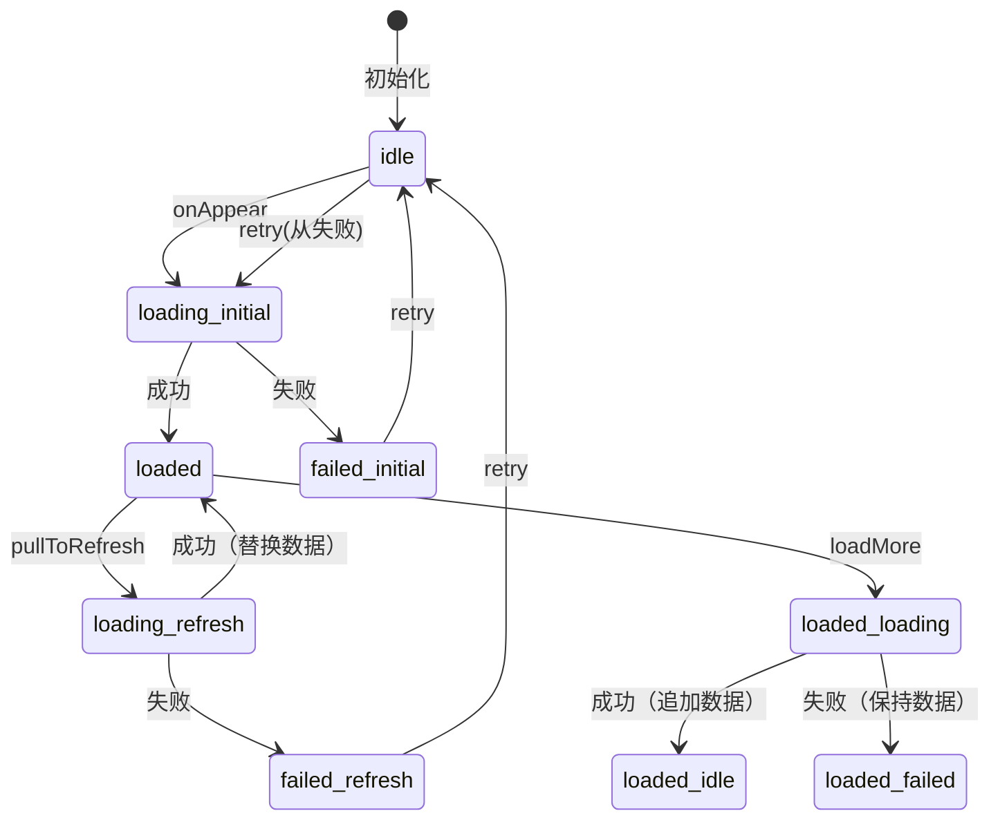
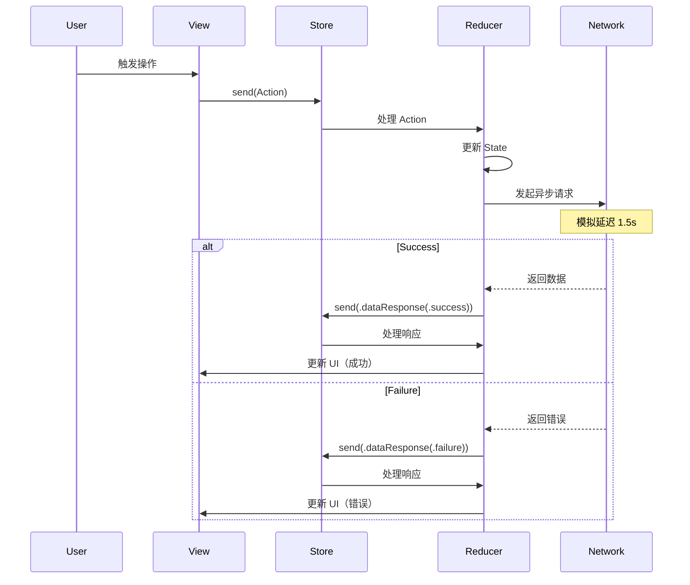

# TCA 架构完整学习指南 / TCA Architecture Complete Study Guide
## RefreshableList 源码深度剖析

> 本文档整合了所有分析内容，作为学习 TCA 架构和源码的完整指南

---

## 📚 目录 / Table of Contents

### 第一部分：架构基础 / Part 1: Architecture Foundation
1. [TCA 架构概述](#1-tca-架构概述--tca-architecture-overview)
2. [项目结构与文件组织](#2-项目结构与文件组织--project-structure)
3. [核心组件详解](#3-核心组件详解--core-components)

### 第二部分：状态管理 / Part 2: State Management  
4. [State 状态定义](#4-state-状态定义--state-definition)
5. [ReduxPageState 状态机](#5-reduxpagestate-状态机--state-machine)
6. [状态流转完整路径](#6-状态流转完整路径--state-flow-paths)

### 第三部分：Action 与 Reducer / Part 3: Actions and Reducer
7. [Action 类型与触发](#7-action-类型与触发--action-types)
8. [Reducer 处理逻辑](#8-reducer-处理逻辑--reducer-logic)
9. [副作用 (Side Effects) 管理](#9-副作用管理--side-effects)

### 第四部分：网络请求处理 / Part 4: Network Request Handling
10. [网络请求生命周期](#10-网络请求生命周期--request-lifecycle)
11. [错误类型判断机制](#11-错误类型判断机制--error-detection)
12. [重试逻辑详解](#12-重试逻辑详解--retry-logic)

### 第五部分：UI 响应机制 / Part 5: UI Response
13. [View 层架构](#13-view-层架构--view-architecture)
14. [加载状态 UI 展示](#14-加载状态-ui-展示--loading-ui)
15. [错误状态 UI 展示](#15-错误状态-ui-展示--error-ui)

### 第六部分：实战分析 / Part 6: Practical Analysis
16. [完整用户场景分析](#16-完整用户场景分析--user-scenarios)
17. [调试技巧与日志](#17-调试技巧与日志--debugging)
18. [最佳实践总结](#18-最佳实践总结--best-practices)

---

## 第一部分：架构基础 / Part 1: Architecture Foundation

### 1. TCA 架构概述 / TCA Architecture Overview

#### 1.1 什么是 TCA？

The Composable Architecture (TCA) 是一个用于构建 Swift 应用的框架，具有以下核心特性：

- **单向数据流** (Unidirectional Data Flow)
- **状态不可变** (Immutable State)  
- **副作用隔离** (Side Effects Isolation)
- **类型安全** (Type Safety)
- **可测试性** (Testability)

#### 1.2 TCA 数据流

```
用户交互 → View → Action → Store → Reducer → State变更 → View更新
                                         ↓
                                    Side Effect
                                         ↓
                                     Network
                                         ↓
                                     Response
                                         ↓
                                    New Action
```

#### 1.3 项目中的 TCA 实现架构

```
┌─────────────────────────────────────────────────────────┐
│                     SwiftUI View                         │
│              (RefreshableListView.swift)                 │
│                                                          │
│  - WithViewStore: 连接 Store 和 View                     │
│  - 响应状态变化，更新 UI                                   │
│  - 发送用户 Action                                        │
└────────────────────────┬────────────────────────────────┘
                         │ ViewStore
                         ↓
┌─────────────────────────────────────────────────────────┐
│                      Store                               │
│                  (状态容器/State Container)               │
│                                                          │
│  - 持有当前 State                                         │
│  - 接收 Action                                           │
│  - 调用 Reducer 处理                                      │
└────────────────────────┬────────────────────────────────┘
                         │
                         ↓
┌─────────────────────────────────────────────────────────┐
│                     Reducer                              │
│           (RefreshableListFeature.swift)                 │
│                                                          │
│  - 纯函数：(State, Action) → (State, Effect)             │
│  - 处理业务逻辑                                           │
│  - 返回新状态和副作用                                      │
└─────────────────────────────────────────────────────────┘
                         │
                         ↓
┌─────────────────────────────────────────────────────────┐
│                    Side Effects                          │
│            (NetworkRequestManager.swift)                 │
│                                                          │
│  - 异步操作（网络请求）                                    │
│  - 返回新的 Action                                       │
└─────────────────────────────────────────────────────────┘
```

---

### 2. 项目结构与文件组织 / Project Structure

```
ReduxSwiftUIDemo/
│
├── Features/                              # TCA 功能模块
│   ├── RefreshableListFeature.swift     # 列表功能 Reducer
│   │   ├── State (行 34-86)             # 状态定义
│   │   ├── Action (行 88-107)           # 动作定义
│   │   └── Reducer (行 111-311)         # 处理逻辑
│   │
│   └── AppFeature.swift                 # 应用根 Reducer
│
├── Views/                                # UI 视图层
│   ├── RefreshableListView.swift        # 列表视图
│   │   ├── LoadingOverlay (行 14-63)    # 加载遮罩
│   │   ├── ListContent (行 369-391)     # 列表内容
│   │   ├── ErrorViews (行 570-698)      # 错误视图
│   │   └── LoadMoreView (行 806-915)    # 加载更多
│   │
│   └── Components/                      # 可复用组件
│
├── Models/                               # 数据模型
│   ├── ReduxPageState.swift             # 页面状态枚举
│   │   ├── 状态定义 (行 13-22)
│   │   ├── 嵌套类型 (行 24-104)
│   │   └── 计算属性 (行 106-170)
│   │
│   └── BaseListState.swift              # 列表数据结构
│       ├── ListData (行 10-22)
│       └── MockItem (行 69-125)
│
└── Services/                             # 服务层
    └── NetworkRequestManager.swift      # 网络请求
        ├── 请求模拟 (行 70-143)
        └── 错误定义 (行 28-58)
```

---

### 3. 核心组件详解 / Core Components

#### 3.1 Store (状态容器)

Store 是 TCA 的核心，负责：
- 持有应用状态 (State)
- 接收用户动作 (Action)
- 调用 Reducer 处理逻辑
- 通知 View 更新

```swift
// 创建 Store
let store: StoreOf<RefreshableListFeature>

// 在 View 中使用
WithViewStore(self.store, observe: { $0 }) { viewStore in
    // View 实现
}
```

#### 3.2 ViewStore (视图存储)

ViewStore 是 Store 的视图层接口：
- 提供状态的只读访问
- 提供发送 Action 的方法
- 优化性能，避免不必要的重渲染

```swift
// 读取状态
viewStore.pageState
viewStore.items

// 发送 Action
viewStore.send(.onAppear)
viewStore.send(.pullToRefresh)
```

#### 3.3 Reducer (处理器)

Reducer 是纯函数，负责状态转换：

```swift
@Reducer
struct RefreshableListFeature {
    var body: some ReducerOf<Self> {
        Reduce { state, action in
            // 状态转换逻辑
            // 返回 Effect 或 .none
        }
    }
}
```

---

## 第二部分：状态管理 / Part 2: State Management

### 4. State 状态定义 / State Definition

#### 4.1 完整的 State 结构

```swift
// RefreshableListFeature.swift:34-86
@ObservableState
struct State: Equatable {
    // ===== 核心状态 =====
    /// 页面状态（使用 ReduxPageState 枚举）
    var pageState: ReduxPageState<ListData<MockItem>> = .idle
    
    // ===== 模拟控制 =====
    /// 是否模拟错误
    var simulateError: Bool = false
    /// 是否模拟空数据
    var simulateEmpty: Bool = false
    
    // ===== UI 控制 =====
    /// 刷新错误信息（用于显示错误提示条）
    var refreshErrorInfo: ReduxPageState<ListData<MockItem>>.ErrorInfo?
    /// 当前选择的筛选选项
    var selectedFilter: OrderFilterOption = .all
    /// 是否显示筛选下拉菜单
    var showFilterDropdown: Bool = false
    /// 是否正在切换筛选
    var isChangingFilter: Bool = false
    /// 是否显示全屏加载遮罩
    var showLoadingOverlay: Bool = false
    
    // ===== 计算属性 =====
    /// 获取列表项
    var items: [MockItem] {
        if case let .loaded(data, _) = pageState {
            return data.items
        }
        return []
    }
    
    /// 是否显示空视图
    var showEmptyView: Bool {
        if case let .loaded(data, _) = pageState {
            return data.isEmpty
        }
        return false
    }
    
    /// 是否显示初始加载
    var showInitialLoading: Bool {
        if case .loading(.initial) = pageState {
            return true
        }
        return false
    }
    
    /// 是否显示初始错误
    var showInitialError: Bool {
        if case .failed(.initial, _) = pageState {
            return true
        }
        return false
    }
}
```

#### 4.2 State 设计原则

1. **单一数据源**：所有状态集中在一个 State 结构体中
2. **不可变性**：State 是值类型，每次修改都创建新实例
3. **类型安全**：使用枚举和强类型，编译时检查
4. **计算属性**：派生状态通过计算属性获取，避免冗余

---

### 5. ReduxPageState 状态机 / State Machine

#### 5.1 状态枚举定义

```swift
// ReduxPageState.swift:13-22
enum ReduxPageState<Content: Equatable>: Equatable {
    /// 空闲状态，还未发起请求
    case idle
    
    /// 加载中，包含不同的加载类型
    case loading(LoadingType)
    
    /// 加载成功，包含内容和加载更多状态
    case loaded(Content, LoadMoreState)
    
    /// 加载失败，包含失败类型和错误信息
    case failed(FailureType, ErrorInfo)
}
```

#### 5.2 嵌套类型详解

```swift
// 加载类型
enum LoadingType: Equatable {
    case initial  // 首次加载
    case refresh  // 下拉刷新
    case loadMore // 加载更多
}

// 加载更多状态
enum LoadMoreState: Equatable {
    case idle           // 空闲，可以加载更多
    case loading        // 正在加载更多
    case noMore         // 没有更多数据
    case failed(ErrorInfo) // 加载更多失败
}

// 失败类型
enum FailureType: Equatable {
    case initial  // 初始加载失败
    case refresh  // 刷新失败
    case loadMore // 加载更多失败
}

// 错误信息
struct ErrorInfo: Equatable {
    let type: ErrorType          // 错误类型
    let description: String       // 错误描述
    let code: Int?               // 错误码（可选）
}

// 错误类型
enum ErrorType: Equatable {
    case networkConnection  // 网络连接错误
    case timeout           // 请求超时
    case serverError       // 服务器错误
    case parsingError      // 数据解析错误
    case unknown           // 未知错误
}
```

#### 5.3 状态机转换规则



---

### 6. 状态流转完整路径 / State Flow Paths

#### 6.1 初始加载路径

```
用户场景：首次打开页面
━━━━━━━━━━━━━━━━━━━━━━━━━━━━━━━━━━━━━━━━━━━━━━━━

1. 初始状态
   State: { pageState: .idle }
   ↓
2. 触发 onAppear
   Action: .onAppear
   ↓
3. 开始加载
   State: { pageState: .loading(.initial), showLoadingOverlay: true }
   ↓
4a. 成功路径
    Response: .success(data)
    State: { pageState: .loaded(data, .idle), showLoadingOverlay: false }
    
4b. 失败路径
    Response: .failure(error)
    State: { pageState: .failed(.initial, errorInfo), showLoadingOverlay: false }
    ↓
5. 用户重试（仅失败时）
   Action: .retry
   State: { pageState: .idle } → 回到步骤2
```

#### 6.2 下拉刷新路径

```
用户场景：下拉刷新列表
━━━━━━━━━━━━━━━━━━━━━━━━━━━━━━━━━━━━━━━━━━━━━━━━

1. 初始状态（有数据）
   State: { pageState: .loaded(existingData, .idle) }
   ↓
2. 触发下拉
   Action: .pullToRefresh
   ↓
3. 保存当前数据并开始刷新
   previousData = existingData
   State: { pageState: .loading(.refresh), showLoadingOverlay: true }
   ↓
4a. 成功路径
    Response: .success(newData)
    State: { pageState: .loaded(newData, .idle), showLoadingOverlay: false }
    // 注意：数据被完全替换
    
4b. 失败路径
    Response: .failure(error)
    State: { 
        pageState: .failed(.refresh, errorInfo),
        refreshErrorInfo: errorInfo,  // 额外保存用于横幅显示
        showLoadingOverlay: false 
    }
    ↓
5. 用户重试（仅失败时）
   Action: .pullToRefresh （直接发送，不经过.retry）
   → 回到步骤3
```

#### 6.3 加载更多路径

```
用户场景：滑动到底部加载更多
━━━━━━━━━━━━━━━━━━━━━━━━━━━━━━━━━━━━━━━━━━━━━━━━

1. 初始状态（有数据且有更多页）
   State: { pageState: .loaded(data, .idle), data.hasMorePages: true }
   ↓
2. 触发加载更多
   Action: .loadMore
   ↓
3. 更新加载状态
   State: { pageState: .loaded(data, .loading), showLoadingOverlay: true }
   ↓
4a. 成功路径
    Response: .success(newData)
    合并数据：combinedData = existingData + newData
    State: { 
        pageState: .loaded(combinedData, newData.hasMore ? .idle : .noMore),
        showLoadingOverlay: false 
    }
    
4b. 失败路径
    Response: .failure(error)
    State: { 
        pageState: .loaded(data, .failed(errorInfo)),  // 保持原数据
        showLoadingOverlay: false 
    }
    ↓
5. 用户重试（仅失败时）
   Action: 直接调用 onLoadMore() → .loadMore
   → 回到步骤3
```

---

## 第三部分：Action 与 Reducer / Part 3: Actions and Reducer

### 7. Action 类型与触发 / Action Types

#### 7.1 Action 枚举定义

```swift
// RefreshableListFeature.swift:88-107
enum Action {
    // ===== 生命周期 =====
    /// 页面出现
    case onAppear
    
    // ===== 用户交互 =====
    /// 下拉刷新
    case pullToRefresh
    /// 加载更多
    case loadMore
    /// 重试
    case retry
    
    // ===== 数据响应 =====
    /// 数据响应（成功或失败）
    case dataResponse(
        Result<ListData<MockItem>, Error>,  // 结果
        isLoadMore: Bool,                   // 是否是加载更多
        previousData: ListData<MockItem>?   // 之前的数据
    )
    
    // ===== 控制开关 =====
    /// 切换错误模拟
    case toggleErrorSimulation
    /// 切换空数据模拟
    case toggleEmptySimulation
    
    // ===== 筛选相关 =====
    /// 切换筛选下拉菜单
    case toggleFilterDropdown
    /// 选择筛选选项
    case selectFilter(OrderFilterOption)
}
```

#### 7.2 Action 触发源

| Action | 触发源 | 触发时机 |
|--------|--------|---------|
| `.onAppear` | View 生命周期 | 页面首次显示 |
| `.pullToRefresh` | 用户手势/按钮 | 下拉刷新/点击重试 |
| `.loadMore` | 用户交互 | 点击加载更多按钮 |
| `.retry` | 错误页面按钮 | 初始加载失败后点击重试 |
| `.dataResponse` | 网络请求回调 | 请求完成（内部触发） |
| `.toggleErrorSimulation` | 开关控件 | 切换错误模拟 |
| `.toggleEmptySimulation` | 开关控件 | 切换空数据模拟 |
| `.toggleFilterDropdown` | 筛选按钮 | 显示/隐藏筛选菜单 |
| `.selectFilter` | 筛选选项 | 选择筛选条件 |

---

### 8. Reducer 处理逻辑 / Reducer Logic

#### 8.1 Reducer 结构

```swift
var body: some ReducerOf<Self> {
    Reduce { state, action in
        switch action {
        case .onAppear:
            // 处理逻辑
            return .none 或 .run { ... }
            
        case .pullToRefresh:
            // 处理逻辑
            return Effect
            
        // ... 其他 case
        }
    }
}
```

#### 8.2 详细的 Action 处理

##### 8.2.1 onAppear 处理

```swift
case .onAppear:
    // 步骤1：前置条件检查
    guard case .idle = state.pageState else { return .none }
    
    // 步骤2：更新状态
    state.pageState = .loading(.initial)
    state.showLoadingOverlay = true
    
    // 步骤3：创建副作用（网络请求）
    return .run { [
        simulateEmpty = state.simulateEmpty, 
        simulateError = state.simulateError,
        filter = state.selectedFilter
    ] send in
        // 3.1 确定请求类型
        let requestType: NetworkRequestManager.RequestResult = 
            simulateError ? .failure : 
            (simulateEmpty ? .successWithEmpty : .success)
        
        // 3.2 执行异步请求
        do {
            let data = try await NetworkRequestManager.simulateListRequest(
                page: 0,
                requestType: requestType,
                filterOption: filter
            )
            // 3.3 发送成功响应
            await send(.dataResponse(
                .success(data), 
                isLoadMore: false, 
                previousData: nil
            ))
        } catch {
            // 3.4 发送失败响应
            await send(.dataResponse(
                .failure(error), 
                isLoadMore: false, 
                previousData: nil
            ))
        }
    }
```

##### 8.2.2 pullToRefresh 处理

```swift
case .pullToRefresh:
    // 步骤1：防止重复刷新
    guard !state.pageState.isLoading else { return .none }
    
    // 步骤2：UI 状态更新
    state.showLoadingOverlay = true
    state.refreshErrorInfo = nil  // 清除之前的错误
    
    // 步骤3：保存当前数据
    var previousData: ListData<MockItem>? = nil
    if case let .loaded(data, _) = state.pageState {
        previousData = data
    }
    
    // 步骤4：设置刷新状态
    if previousData != nil || case .failed = state.pageState {
        state.pageState = .loading(.refresh)
    } else {
        state.pageState = .loading(.initial)
    }
    
    // 步骤5：发起网络请求
    return .run { [
        simulateEmpty = state.simulateEmpty,
        simulateError = state.simulateError,
        previousData,
        filter = state.selectedFilter
    ] send in
        let requestType = simulateError ? .failure : 
                         (simulateEmpty ? .successWithEmpty : .success)
        
        do {
            // 注意：刷新始终从第0页开始
            let data = try await NetworkRequestManager.simulateListRequest(
                page: 0,
                requestType: requestType,
                filterOption: filter
            )
            await send(.dataResponse(
                .success(data), 
                isLoadMore: false, 
                previousData: previousData
            ))
        } catch {
            await send(.dataResponse(
                .failure(error), 
                isLoadMore: false, 
                previousData: previousData
            ))
        }
    }
```

##### 8.2.3 loadMore 处理

```swift
case .loadMore:
    // 步骤1：检查是否可以加载更多
    guard case let .loaded(data, loadMoreState) = state.pageState,
          data.hasMorePages else {
        return .none
    }
    
    // 步骤2：检查加载状态
    switch loadMoreState {
    case .idle, .failed:
        // 可以加载
        state.pageState = .loaded(data, .loading)
        state.showLoadingOverlay = true
    case .loading, .noMore:
        // 不能加载
        return .none
    }
    
    // 步骤3：请求下一页
    return .run { [
        nextPage = data.currentPage + 1,
        simulateError = state.simulateError,
        filter = state.selectedFilter
    ] send in
        let requestType = simulateError ? .failure : .success
        
        do {
            let newData = try await NetworkRequestManager.simulateListRequest(
                page: nextPage,
                requestType: requestType,
                filterOption: filter
            )
            await send(.dataResponse(
                .success(newData), 
                isLoadMore: true,  // 注意这里是 true
                previousData: nil
            ))
        } catch {
            await send(.dataResponse(
                .failure(error), 
                isLoadMore: true,  // 注意这里是 true
                previousData: nil
            ))
        }
    }
```

##### 8.2.4 dataResponse 处理（核心）

```swift
case let .dataResponse(result, isLoadMore, previousData):
    // 步骤1：UI 状态重置
    state.showLoadingOverlay = false
    state.isChangingFilter = false
    
    switch result {
    case let .success(newData):
        // ===== 成功处理 =====
        state.refreshErrorInfo = nil  // 清除错误信息
        
        if isLoadMore {
            // 加载更多成功：追加数据
            if case let .loaded(existingData, _) = state.pageState {
                var combinedData = existingData
                combinedData.items.append(contentsOf: newData.items)
                combinedData.currentPage = newData.currentPage
                combinedData.hasMorePages = newData.hasMorePages
                
                let loadMoreState: LoadMoreState = 
                    newData.hasMorePages ? .idle : .noMore
                state.pageState = .loaded(combinedData, loadMoreState)
            }
        } else {
            // 初始加载或刷新成功：替换数据
            let loadMoreState: LoadMoreState = 
                newData.hasMorePages ? .idle : .noMore
            state.pageState = .loaded(newData, loadMoreState)
        }
        
    case let .failure(error):
        // ===== 失败处理 =====
        let errorInfo = ReduxPageState<ListData<MockItem>>.ErrorInfo(
            type: .networkConnection,
            description: error.localizedDescription
        )
        
        if isLoadMore {
            // 加载更多失败：保留数据，更新状态
            if case let .loaded(data, _) = state.pageState {
                state.pageState = .loaded(data, .failed(errorInfo))
            }
        } else {
            // 判断是刷新还是初始加载
            let wasRefreshing = if case .loading(.refresh) = state.pageState { 
                true 
            } else { 
                false 
            }
            
            if wasRefreshing {
                // 刷新失败
                state.pageState = .failed(.refresh, errorInfo)
                state.refreshErrorInfo = errorInfo  // 额外保存
            } else {
                // 初始加载失败
                state.pageState = .failed(.initial, errorInfo)
            }
        }
    }
    return .none
```

---

### 9. 副作用管理 / Side Effects

#### 9.1 什么是副作用？

在 TCA 中，副作用是指：
- 网络请求
- 定时器
- 文件 I/O
- 任何异步操作

#### 9.2 副作用的创建

```swift
// 使用 .run 创建副作用
return .run { send in
    // 异步操作
    let result = await someAsyncOperation()
    // 发送新的 Action
    await send(.someAction(result))
}

// 不需要副作用时返回 .none
return .none
```

#### 9.3 副作用的最佳实践

1. **捕获必要的状态**
```swift
return .run { [
    // 捕获需要的状态值
    page = state.currentPage,
    filter = state.filter
] send in
    // 使用捕获的值
}
```

2. **错误处理**
```swift
do {
    let data = try await networkRequest()
    await send(.success(data))
} catch {
    await send(.failure(error))
}
```

3. **取消机制**
```swift
// 使用 withTaskCancellation
return .run { send in
    await withTaskCancellation(id: CancelID.request) {
        // 可取消的任务
    }
}
```

---

## 第四部分：网络请求处理 / Part 4: Network Request Handling

### 10. 网络请求生命周期 / Request Lifecycle

#### 10.1 请求流程图



#### 10.2 NetworkRequestManager 实现

```swift
// NetworkRequestManager.swift
static func simulateListRequest(
    page: Int,
    perPage: Int = 20,
    requestType: RequestResult = .success,
    delay: TimeInterval = 1.5
) async throws -> ListData<MockItem> {
    // 步骤1：模拟网络延迟
    try await Task.sleep(nanoseconds: UInt64(delay * 1_000_000_000))
    
    // 步骤2：根据请求类型返回结果
    switch requestType {
    case .success:
        // 生成模拟数据
        let totalItems = 100
        let items = MockDataManager.generatePagedMockItems(
            page: page,
            perPage: perPage,
            totalItems: totalItems
        )
        let hasMore = (page + 1) * perPage < totalItems
        return ListData(items: items, currentPage: page, hasMorePages: hasMore)
        
    case .successWithEmpty:
        // 返回空数据
        return ListData(items: [], currentPage: page, hasMorePages: false)
        
    case .failure:
        // 抛出错误
        throw NetworkError.requestFailed(.networkConnection)
    }
}
```

---

### 11. 错误类型判断机制 / Error Detection

#### 11.1 核心问题

**如何判断一个网络错误是：**
1. 初始加载错误？
2. 下拉刷新错误？
3. 加载更多错误？

#### 11.2 判断机制详解

##### 关键代码位置
文件：`RefreshableListFeature.swift`  
行数：240-266（dataResponse 处理）

##### 判断流程

```swift
case let .dataResponse(result, isLoadMore, previousData):
    switch result {
    case .failure(error):
        // 创建错误信息
        let errorInfo = ReduxPageState<ListData<MockItem>>.ErrorInfo(...)
        
        // 第一层判断：通过 isLoadMore 参数
        if isLoadMore {
            // ✅ 确定是加载更多错误
            if case let .loaded(data, _) = state.pageState {
                state.pageState = .loaded(data, .failed(errorInfo))
            }
        } else {
            // 第二层判断：检查之前的状态
            let wasRefreshing = if case .loading(.refresh) = state.pageState { 
                true 
            } else { 
                false 
            }
            
            if wasRefreshing {
                // ✅ 确定是刷新错误
                state.pageState = .failed(.refresh, errorInfo)
                state.refreshErrorInfo = errorInfo
            } else {
                // ✅ 确定是初始加载错误
                state.pageState = .failed(.initial, errorInfo)
            }
        }
    }
```

#### 11.3 判断依据总结

| 错误类型 | 判断条件 | 关键参数 |
|---------|---------|---------|
| **初始加载错误** | `isLoadMore == false` && `pageState != .loading(.refresh)` | 之前状态通常是 `.loading(.initial)` |
| **刷新错误** | `isLoadMore == false` && `pageState == .loading(.refresh)` | 检查 `wasRefreshing` |
| **加载更多错误** | `isLoadMore == true` | 直接通过参数判断 |

#### 11.4 isLoadMore 参数来源

```swift
// 初始加载：isLoadMore = false
case .onAppear:
    await send(.dataResponse(result, isLoadMore: false, ...))

// 下拉刷新：isLoadMore = false
case .pullToRefresh:
    await send(.dataResponse(result, isLoadMore: false, ...))

// 加载更多：isLoadMore = true
case .loadMore:
    await send(.dataResponse(result, isLoadMore: true, ...))
```

---

### 12. 重试逻辑详解 / Retry Logic

#### 12.1 核心问题

**如何判断重试请求的类型？**
- 是重试初始加载？
- 是重试刷新？
- 是重试加载更多？

#### 12.2 三种重试机制

##### 12.2.1 初始加载失败的重试

```swift
// 触发位置：InitialErrorView 的重试按钮
Button(action: { viewStore.send(.retry) }) {
    Label("重试 / Retry", systemImage: "arrow.clockwise")
}

// Reducer 处理
case .retry:
    if case .failed(.initial, _) = state.pageState {
        state.pageState = .idle
        state.showLoadingOverlay = true
        return .send(.onAppear)  // 触发初始加载
    }
```

**流程：**
1. 用户点击全屏错误页的重试按钮
2. 发送 `.retry` Action
3. 判断当前状态是 `.failed(.initial, _)`
4. 重置为 `.idle`
5. 发送 `.onAppear` 重新加载

##### 12.2.2 刷新失败的重试

```swift
// 触发位置：RefreshErrorBanner 的重试按钮
Button(action: { viewStore.send(.pullToRefresh) }) {
    Text("重试 / Retry")
}

// 注意：直接发送 .pullToRefresh，不经过 .retry
```

**流程：**
1. 用户点击错误横幅的重试按钮
2. 直接发送 `.pullToRefresh` Action
3. 执行刷新逻辑

##### 12.2.3 加载更多失败的重试

```swift
// 触发位置：LoadMoreView 的重试按钮
Button(action: onLoadMore) {
    Text("点击重试 / Tap to retry")
}

// onLoadMore 闭包会发送 .loadMore
let onLoadMore: () -> Void = {
    viewStore.send(.loadMore)
}
```

**流程：**
1. 用户点击底部错误区的重试按钮
2. 调用 `onLoadMore` 闭包
3. 发送 `.loadMore` Action
4. 重新尝试加载下一页

#### 12.3 重试机制对比

| 错误类型 | 重试方式 | 触发 Action | 最终执行 |
|---------|---------|------------|---------|
| 初始加载失败 | 通过 `.retry` | `.retry` → `.onAppear` | 重新初始化 |
| 刷新失败 | 直接重试 | `.pullToRefresh` | 直接刷新 |
| 加载更多失败 | 直接重试 | `.loadMore` | 继续加载 |

#### 12.4 设计理念

- **语义保持**：每种重试保持原操作的语义
- **状态管理**：只有初始加载需要完全重置状态
- **用户体验**：重试操作符合用户预期

---

## 第五部分：UI 响应机制 / Part 5: UI Response

### 13. View 层架构 / View Architecture

#### 13.1 View 组件层次

```
RefreshableListView (主视图)
├── LoadingOverlay (全屏加载遮罩)
├── OrderFilterDropdown (筛选下拉菜单)
├── ControlPanel (控制面板)
└── ListContent (列表内容)
    ├── InitialLoadingView (初始加载)
    ├── InitialErrorView (初始错误)
    ├── EmptyListView (空列表)
    └── ScrollView/List (实际列表)
        ├── RefreshErrorView (刷新错误横幅)
        ├── ListItemView (列表项)
        └── LoadMoreView (加载更多)
```

#### 13.2 状态到 UI 的映射

```swift
// RefreshableListView.swift:373-390
var body: some View {
    Group {
        if viewStore.showInitialLoading {
            // 显示初始加载动画
            InitialLoadingView()
            
        } else if viewStore.showInitialError {
            // 显示全屏错误页
            InitialErrorView(viewStore: viewStore)
            
        } else if viewStore.showEmptyView {
            // 显示空数据页面
            EmptyListView()
            
        } else {
            // 显示实际列表内容
            if #available(iOS 16.0, *) {
                ModernRefreshableScrollView(viewStore: viewStore)
            } else {
                LegacyRefreshableScrollView(viewStore: viewStore)
            }
        }
    }
}
```

---

### 14. 加载状态 UI 展示 / Loading UI

#### 14.1 LoadingOverlay (全屏加载遮罩)

```swift
// RefreshableListView.swift:14-63
struct LoadingOverlay: View {
    let isLoading: Bool
    let message: String
    
    var body: some View {
        if isLoading {
            ZStack {
                // 背景遮罩 - 拦截所有交互
                Color.black
                    .opacity(0.4)
                    .ignoresSafeArea()
                    .allowsHitTesting(true)  // 拦截触摸
                
                // 中央加载卡片
                VStack(spacing: 20) {
                    ProgressView()
                        .progressViewStyle(CircularProgressViewStyle(tint: .blue))
                        .scaleEffect(1.5)
                    
                    Text(message)
                        .font(.subheadline)
                        .foregroundColor(.secondary)
                }
                .padding(30)
                .background(
                    RoundedRectangle(cornerRadius: 12)
                        .fill(Color.white)
                        .shadow(radius: 10)
                )
            }
            .zIndex(999)  // 确保在最顶层
            .transition(.opacity)
            .animation(.easeInOut(duration: 0.2), value: isLoading)
        }
    }
}
```

#### 14.2 加载消息的动态生成

```swift
// RefreshableListView.swift:107-124
private func getLoadingMessage(viewStore: ViewStore<...>) -> String {
    // 根据状态返回不同的加载消息
    if viewStore.isChangingFilter {
        return "切换筛选中... / Switching filter..."
    }
    
    switch viewStore.pageState {
    case .loading(.initial):
        return "加载数据中... / Loading data..."
    case .loading(.refresh):
        return "刷新数据中... / Refreshing data..."
    case .loaded(_, .loading):
        return "加载更多... / Loading more..."
    default:
        return "处理中... / Processing..."
    }
}
```

#### 14.3 不同场景的加载展示

| 场景 | UI 展示 | 遮罩显示 | 用户交互 |
|-----|---------|---------|---------|
| 初始加载 | 全屏加载动画 | ✅ 显示 | ❌ 禁止 |
| 下拉刷新 | 系统刷新控件 + 遮罩 | ✅ 显示 | ❌ 禁止 |
| 加载更多 | 底部加载指示器 + 遮罩 | ✅ 显示 | ❌ 禁止 |
| 切换筛选 | 筛选加载遮罩 | ✅ 显示 | ❌ 禁止 |

---

### 15. 错误状态 UI 展示 / Error UI

#### 15.1 三种错误 UI 层次

##### 15.1.1 初始加载错误（全屏）

```swift
// RefreshableListView.swift:654-698
struct InitialErrorView: View {
    var body: some View {
        VStack(spacing: 20) {
            // 错误图标
            Image(systemName: "wifi.exclamationmark")
                .font(.system(size: 60))
                .foregroundColor(.red)
            
            // 错误标题
            Text("加载失败 / Failed to Load")
                .font(.title3)
                .fontWeight(.semibold)
            
            // 错误描述
            Text(errorInfo.description)
                .font(.caption)
                .foregroundColor(.secondary)
            
            // 重试按钮
            Button(action: { viewStore.send(.retry) }) {
                Label("重试 / Retry", systemImage: "arrow.clockwise")
                    .padding(.horizontal, 24)
                    .padding(.vertical, 12)
                    .background(Color.blue)
                    .foregroundColor(.white)
                    .cornerRadius(8)
            }
        }
    }
}
```

##### 15.1.2 刷新错误（顶部横幅）

```swift
// RefreshableListView.swift:570-625
struct RefreshErrorView: View {
    var body: some View {
        VStack(spacing: 12) {
            HStack {
                // 警告图标
                Image(systemName: "exclamationmark.triangle.fill")
                    .foregroundColor(.orange)
                
                // 错误信息
                VStack(alignment: .leading) {
                    Text("刷新失败 / Refresh Failed")
                    Text(errorInfo.description)
                }
                
                // 重试按钮
                Button(action: { viewStore.send(.pullToRefresh) }) {
                    Text("重试 / Retry")
                        .padding(.horizontal, 16)
                        .padding(.vertical, 8)
                        .background(Color.orange.opacity(0.2))
                        .foregroundColor(.orange)
                        .cornerRadius(6)
                }
            }
            .padding()
            Divider()
        }
        .background(Color.yellow.opacity(0.1))  // 警告色背景
        .transition(.move(edge: .top).combined(with: .opacity))
    }
}
```

##### 15.1.3 加载更多错误（底部提示）

```swift
// RefreshableListView.swift:869-914
private func failedView(errorInfo: ErrorInfo) -> some View {
    VStack(spacing: 12) {
        HStack {
            // 错误图标
            Image(systemName: "exclamationmark.circle.fill")
                .foregroundColor(.red)
            
            // 错误信息
            VStack(alignment: .leading) {
                Text("加载更多失败 / Failed to load more")
                Text(errorInfo.description)
            }
        }
        
        // 重试按钮
        Button(action: onLoadMore) {
            HStack {
                Image(systemName: "arrow.clockwise")
                Text("点击重试 / Tap to retry")
            }
            .padding()
            .background(Color.red.opacity(0.1))
            .foregroundColor(.red)
            .cornerRadius(8)
        }
    }
    .padding()
    .background(Color.red.opacity(0.05))
    .cornerRadius(12)
}
```

#### 15.2 错误 UI 设计原则

1. **层次分明**
   - 全屏错误：阻断性，需要解决才能继续
   - 横幅错误：提示性，可以忽略
   - 底部错误：局部性，只影响加载更多

2. **颜色语义**
   - 红色：严重错误（初始加载失败）
   - 橙色/黄色：警告（刷新失败）
   - 浅红色：轻微错误（加载更多失败）

3. **交互设计**
   - 提供明确的重试操作
   - 错误信息简洁明了
   - 动画过渡平滑

---

## 第六部分：实战分析 / Part 6: Practical Analysis

### 16. 完整用户场景分析 / User Scenarios

#### 16.1 场景一：首次使用应用

```
时间线：
━━━━━━━━━━━━━━━━━━━━━━━━━━━━━━━━━━━━━━━━━━━━━━

T0: 用户打开应用
    State: { pageState: .idle }
    UI: 空白页面
    ↓
T1: View.onAppear 触发
    Action: .onAppear
    State: { pageState: .loading(.initial), showLoadingOverlay: true }
    UI: 显示全屏加载动画
    ↓
T2: 网络请求中 (1.5秒)
    State: 不变
    UI: 持续显示加载动画
    ↓
T3a: 请求成功
     Action: .dataResponse(.success(data))
     State: { pageState: .loaded(data, .idle), showLoadingOverlay: false }
     UI: 显示列表数据
     
T3b: 请求失败
     Action: .dataResponse(.failure(error))
     State: { pageState: .failed(.initial, errorInfo), showLoadingOverlay: false }
     UI: 显示全屏错误页面
     ↓
T4: 用户点击重试（失败情况）
    Action: .retry
    State: { pageState: .idle }
    → 返回 T1
```

#### 16.2 场景二：浏览列表并刷新

```
前置条件：已有列表数据
━━━━━━━━━━━━━━━━━━━━━━━━━━━━━━━━━━━━━━━━━━━━━━

T0: 用户下拉列表
    State: { pageState: .loaded(existingData, .idle) }
    UI: 显示下拉刷新控件
    ↓
T1: 触发刷新
    Action: .pullToRefresh
    State: { 
        pageState: .loading(.refresh),
        showLoadingOverlay: true,
        previousData: existingData  // 保存当前数据
    }
    UI: 显示刷新动画 + 遮罩
    ↓
T2: 网络请求中
    State: 不变
    UI: 持续显示刷新动画
    ↓
T3a: 刷新成功
     Action: .dataResponse(.success(newData))
     State: { 
         pageState: .loaded(newData, .idle),  // 数据完全替换
         showLoadingOverlay: false 
     }
     UI: 更新列表，显示新数据
     
T3b: 刷新失败
     Action: .dataResponse(.failure(error))
     State: { 
         pageState: .failed(.refresh, errorInfo),
         refreshErrorInfo: errorInfo,
         showLoadingOverlay: false 
     }
     UI: 清空列表，显示错误横幅
     ↓
T4: 用户点击横幅重试（失败情况）
    Action: .pullToRefresh （直接刷新）
    → 返回 T1
```

#### 16.3 场景三：滑动加载更多

```
前置条件：已有列表数据，且 hasMorePages = true
━━━━━━━━━━━━━━━━━━━━━━━━━━━━━━━━━━━━━━━━━━━━━━

T0: 用户滑动到底部
    State: { pageState: .loaded(data, .idle) }
    UI: 显示"加载更多"按钮
    ↓
T1: 点击加载更多
    Action: .loadMore
    State: { 
        pageState: .loaded(data, .loading),
        showLoadingOverlay: true 
    }
    UI: 底部显示加载动画 + 遮罩
    ↓
T2: 请求下一页
    nextPage = currentPage + 1
    State: 不变
    UI: 持续显示加载动画
    ↓
T3a: 加载成功
     Action: .dataResponse(.success(newData))
     合并数据: combinedData = existingData + newData
     State: { 
         pageState: .loaded(combinedData, newData.hasMore ? .idle : .noMore),
         showLoadingOverlay: false 
     }
     UI: 追加新数据到列表
     
T3b: 加载失败
     Action: .dataResponse(.failure(error))
     State: { 
         pageState: .loaded(data, .failed(errorInfo)),  // 保持原数据
         showLoadingOverlay: false 
     }
     UI: 底部显示错误信息和重试按钮
     ↓
T4: 用户点击重试（失败情况）
    Action: 直接调用 onLoadMore() → .loadMore
    → 返回 T1
```

#### 16.4 场景四：切换筛选条件

```
前置条件：已有列表数据
━━━━━━━━━━━━━━━━━━━━━━━━━━━━━━━━━━━━━━━━━━━━━━

T0: 用户点击筛选按钮
    Action: .toggleFilterDropdown
    State: { showFilterDropdown: true }
    UI: 显示筛选下拉菜单
    ↓
T1: 选择筛选条件
    Action: .selectFilter(.status(OrderStatus.pending))
    State: { 
        selectedFilter: .status(.pending),
        showFilterDropdown: false,
        isChangingFilter: true,
        showLoadingOverlay: true,
        pageState: .idle  // 重置状态
    }
    UI: 隐藏下拉菜单，显示切换遮罩
    ↓
T2: 自动触发重新加载
    Action: .onAppear （内部触发）
    State: { pageState: .loading(.initial) }
    UI: 显示"切换筛选中..."
    ↓
T3: 加载筛选后的数据
    根据 selectedFilter 请求对应数据
    State: { pageState: .loaded(filteredData, .idle) }
    UI: 显示筛选后的列表
```

---

### 17. 调试技巧与日志 / Debugging

#### 17.1 添加调试日志

##### 17.1.1 Action 追踪

```swift
// 在 Reducer 开始处添加
var body: some ReducerOf<Self> {
    Reduce { state, action in
        // 打印每个 Action
        print("🎯 ========== Action: \(action) ==========")
        print("📍 Current State: \(state.pageState)")
        
        switch action {
        // ... 处理逻辑
        }
    }
}
```

##### 17.1.2 状态变化追踪

```swift
case .onAppear:
    print("📊 State Change: \(state.pageState) → .loading(.initial)")
    state.pageState = .loading(.initial)
    // ...
```

##### 17.1.3 网络请求追踪

```swift
// 在 NetworkRequestManager 中
static func simulateListRequest(...) async throws -> ListData<MockItem> {
    print("🌐 ========== Network Request ==========")
    print("🌐 Page: \(page)")
    print("🌐 Filter: \(filterOption)")
    print("🌐 RequestType: \(requestType)")
    
    // ... 请求逻辑
    
    print("✅ Response: items=\(result.items.count), hasMore=\(result.hasMorePages)")
    return result
}
```

#### 17.2 错误判断调试

```swift
case let .dataResponse(result, isLoadMore, previousData):
    print("📊 ========== dataResponse Debug ==========")
    print("📊 isLoadMore: \(isLoadMore)")
    print("📊 Current pageState: \(state.pageState)")
    
    switch result {
    case .failure(let error):
        let wasRefreshing = if case .loading(.refresh) = state.pageState { 
            true 
        } else { 
            false 
        }
        
        print("🔴 Error Detection:")
        print("🔴 isLoadMore: \(isLoadMore)")
        print("🔴 wasRefreshing: \(wasRefreshing)")
        
        if isLoadMore {
            print("✅ Detected: Load More Error")
        } else if wasRefreshing {
            print("✅ Detected: Refresh Error")
        } else {
            print("✅ Detected: Initial Load Error")
        }
    }
```

#### 17.3 UI 更新验证

```swift
// 在 View 中监听状态变化
.onChange(of: viewStore.pageState) { newState in
    print("🎨 UI State Changed: \(newState)")
}

.onChange(of: viewStore.showLoadingOverlay) { isShowing in
    print("🎨 Loading Overlay: \(isShowing)")
}
```

#### 17.4 常见调试场景

| 场景 | 调试重点 | 关键日志 |
|-----|---------|---------|
| 页面不更新 | 检查 State 是否变化 | State Change 日志 |
| 重复请求 | 检查 Action 触发 | Action 日志 |
| 错误类型判断错误 | 检查 isLoadMore 和 pageState | dataResponse Debug |
| 加载状态异常 | 检查 showLoadingOverlay | UI State 日志 |

---

### 18. 最佳实践总结 / Best Practices

#### 18.1 状态管理最佳实践

1. **使用枚举管理复杂状态**
```swift
// ✅ 好的做法：清晰的状态定义
enum PageState {
    case idle
    case loading(LoadingType)
    case loaded(Data, LoadMoreState)
    case failed(FailureType, ErrorInfo)
}

// ❌ 避免：使用多个布尔值
struct State {
    var isLoading: Bool
    var isRefreshing: Bool
    var hasError: Bool
    var errorMessage: String?
}
```

2. **计算属性避免冗余**
```swift
// ✅ 好的做法：使用计算属性
var showInitialLoading: Bool {
    if case .loading(.initial) = pageState {
        return true
    }
    return false
}

// ❌ 避免：存储冗余状态
var showInitialLoading: Bool = false  // 需要手动同步
```

3. **状态转换的原子性**
```swift
// ✅ 好的做法：一次性更新相关状态
state.pageState = .loading(.initial)
state.showLoadingOverlay = true

// ❌ 避免：分散的状态更新
state.isLoading = true
// ... 其他代码
state.loadingType = .initial
```

#### 18.2 Action 设计最佳实践

1. **语义化的 Action 命名**
```swift
// ✅ 好的做法：清晰的意图
case pullToRefresh
case loadMore
case retry

// ❌ 避免：模糊的命名
case refresh
case load
case action
```

2. **合理的 Action 参数**
```swift
// ✅ 好的做法：必要的上下文信息
case dataResponse(
    Result<ListData<MockItem>, Error>,
    isLoadMore: Bool,
    previousData: ListData<MockItem>?
)

// ❌ 避免：过多或过少的参数
case dataResponse(Any)  // 太泛型
```

#### 18.3 副作用处理最佳实践

1. **捕获必要的状态**
```swift
// ✅ 好的做法：只捕获需要的值
return .run { [
    page = state.currentPage,
    filter = state.selectedFilter
] send in
    // 使用捕获的值
}

// ❌ 避免：捕获整个 state
return .run { [state] send in  // 可能导致问题
```

2. **错误处理完备性**
```swift
// ✅ 好的做法：完整的错误处理
do {
    let data = try await networkRequest()
    await send(.dataResponse(.success(data), ...))
} catch {
    await send(.dataResponse(.failure(error), ...))
}

// ❌ 避免：忽略错误
let data = try? await networkRequest()  // 错误被忽略
```

#### 18.4 UI 响应最佳实践

1. **加载状态的用户反馈**
```swift
// ✅ 好的做法：明确的加载提示
LoadingOverlay(
    isLoading: viewStore.showLoadingOverlay,
    message: getLoadingMessage(viewStore: viewStore)
)

// ❌ 避免：无反馈的加载
ProgressView()  // 用户不知道在做什么
```

2. **错误处理的层次性**
```swift
// ✅ 好的做法：不同级别的错误展示
- 初始加载失败 → 全屏错误
- 刷新失败 → 顶部横幅
- 加载更多失败 → 底部提示

// ❌ 避免：统一的错误处理
所有错误都显示 Alert
```

3. **动画和过渡**
```swift
// ✅ 好的做法：平滑的状态过渡
.transition(.opacity.combined(with: .scale))
.animation(.easeInOut(duration: 0.2), value: state)

// ❌ 避免：突兀的状态切换
无动画直接切换视图
```

#### 18.5 性能优化最佳实践

1. **避免不必要的重渲染**
```swift
// ✅ 好的做法：精确的观察
WithViewStore(self.store, observe: \.specificProperty)

// ❌ 避免：观察整个 State
WithViewStore(self.store, observe: { $0 })  // 任何变化都重渲染
```

2. **懒加载和虚拟化**
```swift
// ✅ 好的做法：使用 LazyVStack
LazyVStack {
    ForEach(items) { item in
        ListItemView(item: item)
    }
}

// ❌ 避免：一次性加载所有
VStack {  // 所有项立即渲染
    ForEach(items) { ... }
}
```

---

## 总结 / Conclusion

### 🎯 核心要点

1. **TCA 架构的精髓**
   - 单向数据流保证状态可预测
   - 副作用隔离使逻辑易测试
   - 类型安全减少运行时错误

2. **状态管理的艺术**
   - 使用枚举表达复杂状态
   - 计算属性避免状态冗余
   - 状态转换保持原子性

3. **错误处理的智慧**
   - 通过参数和状态组合判断错误类型
   - 不同错误级别采用不同UI展示
   - 重试机制保持操作语义

4. **用户体验的追求**
   - 及时的加载反馈
   - 清晰的错误提示
   - 流畅的交互动画

### 📚 学习建议

1. **循序渐进**
   - 先理解 TCA 基本概念
   - 再深入状态管理细节
   - 最后研究复杂交互

2. **动手实践**
   - 添加调试日志观察流程
   - 修改代码验证理解
   - 尝试扩展新功能

3. **深入思考**
   - 为什么这样设计？
   - 还有更好的方案吗？
   - 如何应用到自己的项目？

### 🚀 扩展方向

1. **功能扩展**
   - 添加搜索功能
   - 实现批量操作
   - 支持离线缓存

2. **性能优化**
   - 实现预加载
   - 优化列表渲染
   - 减少内存占用

3. **测试完善**
   - 编写单元测试
   - 添加UI测试
   - 性能基准测试

---

> 本文档完整记录了 RefreshableList 的 TCA 实现，从架构设计到具体实现，从状态管理到错误处理，是学习 TCA 架构和 SwiftUI 开发的优秀案例。

**文档版本：** 1.0  
**更新日期：** 2024  
**作者：** AI Assistant  

---

## 附录：快速参考 / Quick Reference

### 文件位置快速索引

| 功能 | 文件 | 关键行数 |
|-----|------|---------|
| Feature 定义 | RefreshableListFeature.swift | 32-312 |
| State | RefreshableListFeature.swift | 34-86 |
| Action | RefreshableListFeature.swift | 88-107 |
| Reducer | RefreshableListFeature.swift | 111-311 |
| 页面状态 | ReduxPageState.swift | 13-170 |
| 网络请求 | NetworkRequestManager.swift | 70-143 |
| 主视图 | RefreshableListView.swift | 103-915 |
| 加载遮罩 | RefreshableListView.swift | 14-63 |
| 错误视图 | RefreshableListView.swift | 570-698 |
| 列表项 | RefreshableListView.swift | 733-802 |

### 状态转换快查

```
idle → loading(.initial) → loaded/failed(.initial)
loaded → loading(.refresh) → loaded/failed(.refresh)
loaded → loaded+loading → loaded+idle/noMore/failed
failed(.initial) → idle → loading(.initial)
failed(.refresh) → loading(.refresh)
```

### Action 触发快查

| 用户操作 | 触发 Action | 最终效果 |
|---------|------------|---------|
| 打开页面 | .onAppear | 初始加载 |
| 下拉手势 | .pullToRefresh | 刷新数据 |
| 点击加载更多 | .loadMore | 加载下一页 |
| 点击重试(初始错误) | .retry | 重新初始加载 |
| 点击重试(刷新错误) | .pullToRefresh | 重新刷新 |
| 点击重试(加载更多错误) | .loadMore | 重新加载更多 |
| 选择筛选 | .selectFilter | 重置并加载 |

---

🎉 **恭喜你完成了 TCA 架构的深度学习！**