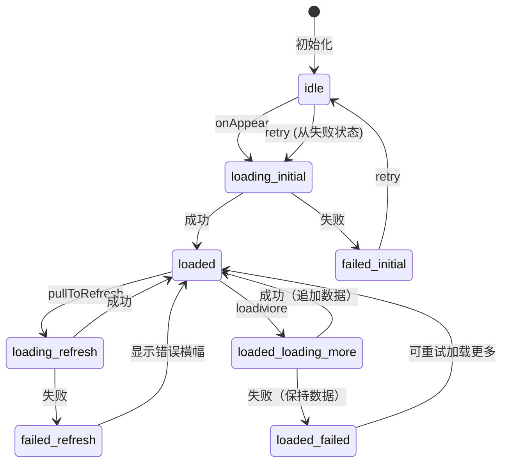
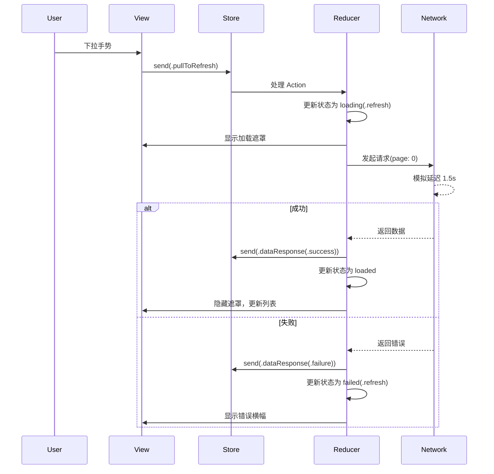

# TCA (The Composable Architecture) 数据流详解 / TCA Data Flow Analysis
## RefreshableList 网络请求与状态管理深度解析

---

## 目录 / Table of Contents

1. [架构概述](#架构概述--architecture-overview)
2. [核心组件](#核心组件--core-components)
3. [状态流转详解](#状态流转详解--state-flow-details)
4. [Action 处理流程](#action-处理流程--action-processing-flow)
5. [网络请求失败处理](#网络请求失败处理--network-failure-handling)
6. [下拉刷新流程](#下拉刷新流程--pull-to-refresh-flow)
7. [加载更多流程](#加载更多流程--load-more-flow)
8. [筛选切换流程](#筛选切换流程--filter-switching-flow)
9. [UI 层响应机制](#ui-层响应机制--ui-response-mechanism)
10. [错误重试机制](#错误重试机制--error-retry-mechanism)

---

## 架构概述 / Architecture Overview

### TCA 核心概念 / TCA Core Concepts

The Composable Architecture (TCA) 是一个用于构建应用程序的库，具有以下特点：
- **单向数据流** (Unidirectional Data Flow)
- **状态管理** (State Management)
- **副作用处理** (Side Effects Handling)
- **测试友好** (Testable)

### 项目中的 TCA 实现结构 / TCA Implementation Structure

```
┌─────────────────────────────────────────────────────────┐
│                     SwiftUI View                         │
│              (RefreshableListView.swift)                 │
└────────────────────────┬────────────────────────────────┘
                         │ ViewStore
                         ↓
┌─────────────────────────────────────────────────────────┐
│                      Store                               │
│                  (状态容器/State Container)               │
└────────────────────────┬────────────────────────────────┘
                         │
                         ↓
┌─────────────────────────────────────────────────────────┐
│                     Reducer                              │
│           (RefreshableListFeature.swift)                 │
│   ┌──────────────────────────────────────────────┐      │
│   │  State: 应用状态定义                           │      │
│   │  Action: 用户行为和事件                        │      │
│   │  Body: 状态转换逻辑                           │      │
│   └──────────────────────────────────────────────┘      │
└─────────────────────────────────────────────────────────┘
                         │
                         ↓
┌─────────────────────────────────────────────────────────┐
│                    Side Effects                          │
│            (NetworkRequestManager.swift)                 │
└─────────────────────────────────────────────────────────┘
```

---

## 核心组件 / Core Components

### 1. State (状态定义)

位置：`RefreshableListFeature.swift:34-86`

```swift
@ObservableState
struct State: Equatable {
    // 核心状态
    var pageState: ReduxPageState<ListData<MockItem>> = .idle
    
    // 控制标志
    var simulateError: Bool = false      // 模拟错误开关
    var simulateEmpty: Bool = false      // 模拟空数据开关
    var showFilterDropdown: Bool = false // 筛选下拉菜单显示
    var isChangingFilter: Bool = false   // 正在切换筛选
    var showLoadingOverlay: Bool = false // 全屏加载遮罩
    
    // 筛选相关
    var selectedFilter: OrderFilterOption = .all
    
    // 错误信息
    var refreshErrorInfo: ReduxPageState<ListData<MockItem>>.ErrorInfo?
}
```

### 2. ReduxPageState (页面状态枚举)

位置：`ReduxPageState.swift:13-170`

```swift
enum ReduxPageState<Content: Equatable>: Equatable {
    case idle                                    // 初始状态
    case loading(LoadingType)                    // 加载中
    case loaded(Content, LoadMoreState)          // 已加载
    case failed(FailureType, ErrorInfo)          // 失败
}

// 加载类型细分
enum LoadingType {
    case initial  // 首次加载
    case refresh  // 下拉刷新
    case loadMore // 加载更多
}

// 加载更多状态
enum LoadMoreState {
    case idle           // 可以加载更多
    case loading        // 正在加载更多
    case noMore         // 没有更多数据
    case failed(ErrorInfo) // 加载失败
}
```

### 3. Actions (行为定义)

位置：`RefreshableListFeature.swift:88-107`

```swift
enum Action {
    case onAppear                    // 页面出现
    case pullToRefresh               // 下拉刷新
    case loadMore                    // 加载更多
    case dataResponse(               // 数据响应
        Result<ListData<MockItem>, Error>, 
        isLoadMore: Bool, 
        previousData: ListData<MockItem>?
    )
    case toggleErrorSimulation       // 切换错误模拟
    case toggleEmptySimulation       // 切换空数据模拟
    case retry                       // 重试
    case toggleFilterDropdown        // 切换筛选下拉
    case selectFilter(OrderFilterOption) // 选择筛选
}
```

---

## 状态流转详解 / State Flow Details

### 完整的状态机图 / Complete State Machine Diagram



---

## Action 处理流程 / Action Processing Flow

### 1. onAppear Action 流程

```swift
case .onAppear:
    // 1. 检查前置条件
    guard case .idle = state.pageState else { return .none }
    
    // 2. 更新状态
    state.pageState = .loading(.initial)
    state.showLoadingOverlay = true  // 显示全屏遮罩
    
    // 3. 发起网络请求（副作用）
    return .run { send in
        // 3.1 确定请求类型
        let requestType = simulateError ? .failure : 
                         (simulateEmpty ? .successWithEmpty : .success)
        
        // 3.2 执行异步请求
        do {
            let data = try await NetworkRequestManager.simulateListRequest(
                page: 0,
                requestType: requestType,
                filterOption: filter
            )
            // 3.3 发送成功响应
            await send(.dataResponse(.success(data), isLoadMore: false, previousData: nil))
        } catch {
            // 3.4 发送失败响应
            await send(.dataResponse(.failure(error), isLoadMore: false, previousData: nil))
        }
    }
```

**详细步骤解析：**

1. **前置条件检查**：只有在 `idle` 状态才会执行，防止重复加载
2. **状态更新**：立即更新为 `loading(.initial)`，UI 显示加载中
3. **遮罩层控制**：设置 `showLoadingOverlay = true` 显示全屏加载遮罩
4. **异步网络请求**：
   - 使用 `.run` 创建副作用
   - 根据模拟标志决定请求结果类型
   - 等待请求完成后发送 `dataResponse` Action

### 2. pullToRefresh Action 流程

位置：`RefreshableListFeature.swift:136-176`

```swift
case .pullToRefresh:
    // 1. 防止重复刷新
    guard !state.pageState.isLoading else { return .none }
    
    // 2. 显示刷新遮罩
    state.showLoadingOverlay = true
    
    // 3. 清除之前的错误信息
    state.refreshErrorInfo = nil
    
    // 4. 保存当前数据（如果有）
    var previousData: ListData<MockItem>? = nil
    if case let .loaded(data, _) = state.pageState {
        previousData = data
    }
    
    // 5. 设置刷新状态
    if previousData != nil || case .failed = state.pageState {
        state.pageState = .loading(.refresh)  // 有数据时为刷新
    } else {
        state.pageState = .loading(.initial)   // 无数据时为初始加载
    }
    
    // 6. 执行刷新请求（从第0页开始）
    return .run { send in
        // ... 网络请求逻辑
    }
```

**关键点：**
- **始终从第0页开始**：刷新会重置所有数据
- **保存当前数据**：用于失败时恢复显示
- **状态区分**：根据是否有数据决定加载类型

### 3. loadMore Action 流程

位置：`RefreshableListFeature.swift:178-208`

```swift
case .loadMore:
    // 1. 检查是否可以加载更多
    guard case let .loaded(data, loadMoreState) = state.pageState,
          data.hasMorePages else {
        return .none
    }
    
    // 2. 检查加载更多状态
    switch loadMoreState {
    case .idle, .failed:
        // 可以加载
        state.pageState = .loaded(data, .loading)
        state.showLoadingOverlay = true
    case .loading, .noMore:
        // 不能加载
        return .none
    }
    
    // 3. 请求下一页数据
    return .run { send in
        let nextPage = data.currentPage + 1
        // ... 请求逻辑
    }
```

**状态转换：**
- `idle` → `loading`：开始加载更多
- `failed` → `loading`：重试加载更多
- `loading`：忽略重复请求
- `noMore`：没有更多数据，忽略请求

### 4. dataResponse Action 处理

位置：`RefreshableListFeature.swift:210-267`

```swift
case let .dataResponse(result, isLoadMore, _):
    // 1. 隐藏遮罩层
    state.showLoadingOverlay = false
    state.isChangingFilter = false
    
    switch result {
    case let .success(newData):
        // 2. 成功处理
        state.refreshErrorInfo = nil  // 清除错误
        
        if isLoadMore {
            // 2.1 加载更多：追加数据
            if case let .loaded(existingData, _) = state.pageState {
                var combinedData = existingData
                combinedData.items.append(contentsOf: newData.items)
                combinedData.currentPage = newData.currentPage
                combinedData.hasMorePages = newData.hasMorePages
                
                let loadMoreState = newData.hasMorePages ? .idle : .noMore
                state.pageState = .loaded(combinedData, loadMoreState)
            }
        } else {
            // 2.2 初始加载或刷新：替换数据
            let loadMoreState = newData.hasMorePages ? .idle : .noMore
            state.pageState = .loaded(newData, loadMoreState)
        }
        
    case let .failure(error):
        // 3. 失败处理
        let errorInfo = ReduxPageState<ListData<MockItem>>.ErrorInfo(
            type: .networkConnection,
            description: error.localizedDescription
        )
        
        if isLoadMore {
            // 3.1 加载更多失败：保留数据，更新加载状态
            if case let .loaded(data, _) = state.pageState {
                state.pageState = .loaded(data, .failed(errorInfo))
            }
        } else {
            // 3.2 初始加载或刷新失败
            let wasRefreshing = if case .loading(.refresh) = state.pageState { 
                true 
            } else { 
                false 
            }
            
            if wasRefreshing {
                // 刷新失败：清空数据，显示错误
                state.pageState = .failed(.refresh, errorInfo)
                state.refreshErrorInfo = errorInfo
            } else {
                // 初始加载失败
                state.pageState = .failed(.initial, errorInfo)
            }
        }
    }
```

---

## 网络请求失败处理 / Network Failure Handling

### 错误类型定义

位置：`ReduxPageState.swift:76-104`

```swift
enum ErrorType: Equatable {
    case networkConnection  // 网络连接错误
    case timeout           // 请求超时
    case serverError       // 服务器错误
    case parsingError      // 数据解析错误
    case unknown           // 未知错误
}
```

### 失败场景处理策略

#### 1. 初始加载失败
```swift
状态：.idle → .loading(.initial) → .failed(.initial, errorInfo)
UI表现：
- 显示全屏错误页面
- 提供重试按钮
- 显示错误描述信息
```

#### 2. 刷新失败
```swift
状态：.loaded(data, _) → .loading(.refresh) → .failed(.refresh, errorInfo)
UI表现：
- 清空现有数据
- 显示错误横幅
- 提供重试按钮
- 记录 refreshErrorInfo
```

#### 3. 加载更多失败
```swift
状态：.loaded(data, .idle) → .loaded(data, .loading) → .loaded(data, .failed(errorInfo))
UI表现：
- 保持现有数据显示
- 底部显示错误信息
- 提供重试按钮
- 可以再次触发加载更多
```

---

## 下拉刷新流程 / Pull-to-Refresh Flow

### iOS 16+ 实现

位置：`RefreshableListView.swift:395-447`

```swift
ScrollView {
    // 内容...
}
.refreshable {
    await withCheckedContinuation { continuation in
        viewStore.send(.pullToRefresh)
        
        // 等待刷新完成
        DispatchQueue.main.asyncAfter(deadline: .now() + 2.0) {
            continuation.resume()
        }
    }
}
```

### iOS 15 实现

位置：`RefreshableListView.swift:451-519`

```swift
List {
    // 内容...
}
.refreshable {
    await performRefresh()
}

private func performRefresh() async {
    viewStore.send(.pullToRefresh)
    
    // 等待刷新开始
    var attempts = 0
    while !viewStore.pageState.isRefreshing && attempts < 5 {
        try? await Task.sleep(nanoseconds: 100_000_000)
        attempts += 1
    }
    
    // 等待刷新完成
    attempts = 0
    while viewStore.pageState.isRefreshing && attempts < 50 {
        try? await Task.sleep(nanoseconds: 100_000_000)
        attempts += 1
    }
}
```

### 刷新流程时序图



---

## 加载更多流程 / Load More Flow

### 触发条件检查

```swift
// 必须满足以下条件才能加载更多：
1. 当前状态为 .loaded
2. hasMorePages = true
3. loadMoreState 为 .idle 或 .failed
```

### 加载更多状态机

```
LoadMoreState 转换：
┌────────┐
│  idle  │──────────► loading ──────────► idle/noMore
└────────┘                │
     ▲                    │
     │                    ▼
     └──────────────── failed
```

### 数据合并策略

```swift
// 加载更多成功时的数据合并
var combinedData = existingData
combinedData.items.append(contentsOf: newData.items)  // 追加新数据
combinedData.currentPage = newData.currentPage        // 更新页码
combinedData.hasMorePages = newData.hasMorePages      // 更新是否有更多
```

---

## 筛选切换流程 / Filter Switching Flow

### 筛选选项定义

位置：`RefreshableListFeature.swift:14-29`

```swift
enum OrderFilterOption: Equatable {
    case all                     // 全部订单
    case status(OrderStatus)     // 特定状态订单
    case noOrders               // 无订单（特殊状态）
}
```

### 切换筛选流程

位置：`RefreshableListFeature.swift:297-308`

```swift
case let .selectFilter(filter):
    // 1. 更新筛选条件
    state.selectedFilter = filter
    state.showFilterDropdown = false
    
    // 2. 显示切换中的遮罩
    state.isChangingFilter = true
    state.showLoadingOverlay = true
    
    // 3. 重置为初始状态并重新加载
    state.pageState = .idle
    return .send(.onAppear)  // 触发重新加载
```

### 筛选数据生成逻辑

位置：`NetworkRequestManager.swift:117-125`

```swift
switch filterOption {
case .all:
    // 返回所有状态的混合数据
    items = MockItem.generateMockItems(page: page, perPage: 10)
case .status(let status):
    // 返回特定状态的数据
    items = MockItem.generateMockItems(page: page, perPage: 10, filterStatus: status)
case .noOrders:
    // 返回空数据
    items = []
}
```

---

## UI 层响应机制 / UI Response Mechanism

### 1. 加载遮罩层 (LoadingOverlay)

位置：`RefreshableListView.swift:14-63`

```swift
struct LoadingOverlay: View {
    let isLoading: Bool
    let message: String
    
    var body: some View {
        if isLoading {
            ZStack {
                // 半透明背景，拦截所有交互
                Color.black.opacity(0.4)
                    .ignoresSafeArea()
                    .allowsHitTesting(true)
                
                // 中央加载卡片
                VStack {
                    ProgressView()
                    Text(message)
                }
                .padding(30)
                .background(RoundedRectangle(cornerRadius: 12).fill(Color.white))
            }
            .zIndex(999)  // 确保在最顶层
        }
    }
}
```

**触发时机：**
- `onAppear`：初始加载
- `pullToRefresh`：下拉刷新
- `loadMore`：加载更多
- `selectFilter`：切换筛选

### 2. 错误视图层次

#### 初始加载错误视图
```swift
VStack {
    Image(systemName: "wifi.exclamationmark")  // 错误图标
    Text("加载失败")                            // 错误标题
    Text(errorInfo.description)                 // 错误描述
    Button("重试") { viewStore.send(.retry) }   // 重试按钮
}
```

#### 刷新错误横幅
```swift
HStack {
    Image(systemName: "exclamationmark.triangle.fill")
    VStack {
        Text("刷新失败")
        Text(errorInfo.description)
    }
    Button("重试") { viewStore.send(.pullToRefresh) }
}
.background(Color.yellow.opacity(0.1))  // 警告色背景
```

#### 加载更多错误
```swift
VStack {
    HStack {
        Image(systemName: "exclamationmark.circle.fill")
        Text("加载更多失败")
        Text(errorInfo.description)
    }
    Button("点击重试") { onLoadMore() }
}
.background(Color.red.opacity(0.05))  // 错误色背景
```

### 3. 状态到UI的映射关系

```swift
// RefreshableListView.swift:373-390
var body: some View {
    Group {
        if viewStore.showInitialLoading {
            InitialLoadingView()        // 初始加载中
        } else if viewStore.showInitialError {
            InitialErrorView()           // 初始加载错误
        } else if viewStore.showEmptyView {
            EmptyListView()              // 空数据
        } else {
            // 显示列表内容
            if #available(iOS 16.0, *) {
                ModernRefreshableScrollView()
            } else {
                LegacyRefreshableScrollView()
            }
        }
    }
}
```

---

## 错误重试机制 / Error Retry Mechanism

### retry Action 处理

位置：`RefreshableListFeature.swift:278-291`

```swift
case .retry:
    if case .failed(.initial, _) = state.pageState {
        // 初始加载失败的重试
        state.pageState = .idle
        state.showLoadingOverlay = true
        return .send(.onAppear)
    } else if case .failed(.refresh, _) = state.pageState {
        // 刷新失败的重试
        state.pageState = .idle
        state.showLoadingOverlay = true
        return .send(.onAppear)
    }
    return .none
```

### 重试触发点

1. **初始加载失败**
   - 位置：全屏错误页面的重试按钮
   - 行为：重置为 `idle`，触发 `onAppear`

2. **刷新失败**
   - 位置：顶部错误横幅的重试按钮
   - 行为：触发 `pullToRefresh`

3. **加载更多失败**
   - 位置：列表底部错误区域的重试按钮
   - 行为：再次触发 `loadMore`

---

## 数据流总结 / Data Flow Summary

### 完整的数据流图

```
用户交互 → View → Action → Store → Reducer → State变更 → View更新
                                      ↓
                                  Side Effect
                                      ↓
                                   Network
                                      ↓
                                  Response
                                      ↓
                                 New Action
```

### 关键特性

1. **单向数据流**：所有状态变更都通过 Action → Reducer → State
2. **副作用隔离**：网络请求等副作用通过 `.run` 处理
3. **状态不可变**：每次都返回新的状态，而不是修改现有状态
4. **类型安全**：所有 Action 和 State 都是强类型的
5. **可测试性**：Reducer 是纯函数，易于测试

---

## 学习要点 / Key Learning Points

### 1. TCA 设计模式优势

- **清晰的职责分离**：View 负责展示，Reducer 负责逻辑，Effect 负责副作用
- **可预测的状态变化**：所有状态变化都有明确的 Action 触发
- **强大的组合能力**：可以将小的 Feature 组合成大的 Feature

### 2. 状态管理最佳实践

- **细粒度的状态定义**：使用枚举区分不同的加载类型和失败类型
- **保存必要的上下文**：如刷新时保存 `previousData`
- **错误恢复机制**：不同类型的错误有不同的恢复策略

### 3. 网络请求处理模式

- **请求去重**：通过状态检查防止重复请求
- **分页管理**：清晰的页码和 hasMore 管理
- **错误边界**：失败时的优雅降级

### 4. UI 响应式更新

- **遮罩层管理**：统一的 loading overlay 控制
- **错误提示层次**：根据错误类型显示不同级别的错误UI
- **平滑的状态过渡**：使用动画和过渡效果

---

## 代码位置索引 / Code Location Index

| 功能模块 | 文件位置 | 行数范围 |
|---------|---------|---------|
| Feature 定义 | RefreshableListFeature.swift | 32-312 |
| State 定义 | RefreshableListFeature.swift | 34-86 |
| Action 定义 | RefreshableListFeature.swift | 88-107 |
| Reducer 实现 | RefreshableListFeature.swift | 111-311 |
| 页面状态枚举 | ReduxPageState.swift | 13-170 |
| 网络请求管理 | NetworkRequestManager.swift | 70-143 |
| View 实现 | RefreshableListView.swift | 103-915 |
| 加载遮罩 | RefreshableListView.swift | 14-63 |
| 错误视图 | RefreshableListView.swift | 654-698 |
| 列表项视图 | RefreshableListView.swift | 733-802 |
| 加载更多视图 | RefreshableListView.swift | 806-915 |

---

## 调试技巧 / Debugging Tips

### 1. 状态追踪

```swift
// 在 Reducer 中添加打印语句追踪状态变化
case .onAppear:
    print("📍 Current State: \(state.pageState)")
    print("🎯 Action: onAppear")
    // ... 处理逻辑
```

### 2. 网络请求监控

```swift
// 在 NetworkRequestManager 中添加日志
print("🌐 Request: page=\(page), filter=\(filterOption)")
print("✅ Response: items=\(data.items.count), hasMore=\(data.hasMorePages)")
```

### 3. UI 更新验证

```swift
// 在 View 中添加 onChange 监听
.onChange(of: viewStore.pageState) { newState in
    print("🎨 UI State Changed: \(newState)")
}
```

---

## 扩展建议 / Extension Suggestions

### 1. 添加缓存机制
- 实现内存缓存或磁盘缓存
- 在网络请求前先检查缓存
- 设置缓存过期策略

### 2. 优化错误处理
- 根据错误码提供更详细的错误信息
- 实现自动重试机制（指数退避）
- 添加错误上报功能

### 3. 性能优化
- 实现预加载机制
- 优化列表项渲染（使用 LazyVStack）
- 添加图片懒加载

### 4. 功能增强
- 添加搜索功能
- 实现多级筛选
- 支持批量操作

---

## 总结 / Summary

这个 RefreshableList 功能展示了 TCA 架构的完整实现，包括：

1. ✅ **完整的状态管理**：从 idle 到 loaded 的完整生命周期
2. ✅ **复杂的用户交互**：下拉刷新、加载更多、筛选切换
3. ✅ **优雅的错误处理**：不同场景的错误恢复策略
4. ✅ **良好的用户体验**：加载遮罩、错误提示、平滑过渡
5. ✅ **iOS 版本兼容**：同时支持 iOS 15 和 iOS 16+

通过学习这个实现，可以掌握：
- TCA 的核心概念和使用方式
- SwiftUI 的响应式编程
- 复杂状态管理的最佳实践
- 网络请求和错误处理模式

这是一个非常好的 TCA 学习案例，涵盖了实际开发中的大部分场景。